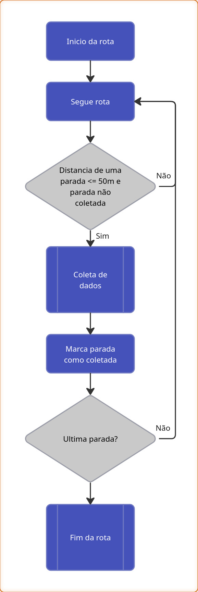

# ComputadoresSociedade
Repositorio destinado a armazenar os codigos do aplicativo da cadeira de computadores e sociedade.

Diagrama da coleta (teórica) dos dados de pessoas dentro dos onibus

Diagrama do banco de dados

